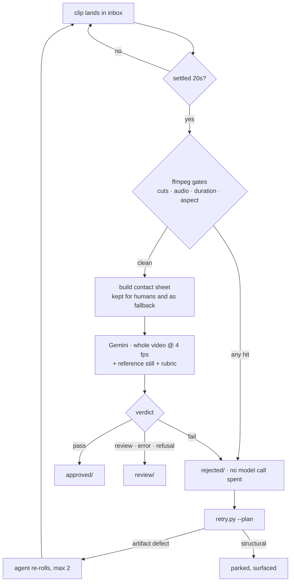

# The pipeline, at a glance

A map of what is actually in this repo, and what state each piece is in. Status
is **what has executed**, not what is written.

## Scope

This repo is one subsystem: the automated quality gate that sits between clip
generation and publication. It grades video only — nothing here grades stills,
writes captions, renders, schedules or posts. Those steps exist elsewhere in the
workflow and are outside this repository entirely; where they are mentioned
below it is only to say where the gate's input comes from and where its output
goes.

The distinction that shapes everything here is "runs as". A `SCRIPT` can be a
cron job. A step that needs an agent session cannot be daemonised, and that
single fact is why generation and the re-roll loop are split the way they are.

## File map

| file | what it is | state |
|---|---|---|
| `scripts/scan.py` | gate 1: ffprobe/ffmpeg objective checks, contact sheet builder, readability guards. Prints a JSON array on stdout for the n8n caller; `collect()` is imported directly by the Python runner | **live** |
| `scripts/pipeline_qc.py` | the Python runner. Both stages, video-native input, routing, logging | **live** — one 24-clip stock run |
| `scripts/qc_config.json` | the shared config both runners read. Gates, sheet geometry, media block, throttle, retry budget | **live** |
| `scripts/rubric_stock.txt` | rubric for raw clips: identity vs reference, defects, realism | **live** |
| `scripts/rubric_reel.txt` | rubric for finished captioned posts: defects, caption legibility, craft | **built**, never run live |
| `scripts/gemini_rubric.txt` | the pre-split rubric, single stage. Read only by `pipeline.py` and `workflow_qc_native.json` | legacy |
| `scripts/retry.py` | the re-roll loop's bookkeeping half: `--plan`, `--ingest`, `--status`. Enforces the attempt cap | **built**, never executed end to end |
| `scripts/move.sh` | no-clobber move + TSV log line. Used by the n8n workflows | **live** |
| `scripts/preflight.sh` | preconditions check. Every line must say OK before importing a workflow | **live** |
| `scripts/test_qc.py` | offline suite, model call mocked. 85 assertions, 14 groups | **live** |
| `pipeline.py` | the original single-file, zero-dependency runner. Contact sheet, single stage | legacy |
| `workflow_qc.json` | n8n workflow, 26 nodes, both stages, container paths. Hourly schedule | **built** — still sends contact sheets, not migrated |
| `workflow_qc_native.json` | earlier single-stage n8n workflow for a host-installed n8n. Paths are placeholders | legacy |
| `Dockerfile` | n8n image with python3 and static ffmpeg staged in | **live** |
| `docker-compose.yml` | the container, volumes, and the n8n env overrides it needs to run Execute Command nodes at all | **live** |
| `tests/make_fixtures.sh` | generates the synthetic clips the suite expects | **live** |
| `context/README.md` | the format of the account-specific context pack. The pack itself is gitignored | **live** |

Files that are account-specific and deliberately absent: `scripts/reference.jpg`
(the canonical still identity is judged against), `context/context_pack.txt`
(style guide + brand context), `.env` (the API key), and everything under
`data/` except the directory structure and the `_log.tsv` verdict logs.

## How a clip is judged

Three destinations, not two. `review/` means nobody actually looked at the clip —
a refused, throttled or unparseable call must never be filed as a real defect.

Before gate 1 there is a set of readability guards that produce a fourth
outcome: **skipped**. A zero-byte file, an unreadable one, one with no decodable
video stream, one modified in the last 20 seconds, or one whose filename
contains shell metacharacters is left in the inbox and reported on stderr. "Can
not read it yet" is not "bad clip".

## The two stages

| | `stock` | `reel` |
|---|---|---|
| input | raw generated clips, no captions | finished captioned posts |
| data root | `data/stock` | `data/reels` |
| duration | 5-9s | 5-45s |
| min aspect | 1.6 | 1.6 |
| silent required | yes | yes |
| reference image | `reference.jpg`, sent first | `null` — identity checked upstream |
| rubric | `rubric_stock.txt` | `rubric_reel.txt` |
| graded on | identity, defects, realism | defects, caption legibility, craft |

The reel window is 45s so that long-form posts are not rejected by the objective
gate before a model ever sees them.

## What the model receives

Parts, in order, from `build_body()`:

1. context pack + rubric + the `MEDIA NOTE` override (video only)
2. `"REFERENCE IMAGE (the persona):"` + the reference still — stock stage only
3. `"VIDEO (the clip under review, in full):"` + the whole mp4, inline

`generationConfig` is `temperature: 0`, `responseMimeType: application/json`, and
`mediaResolution` only when the config asks for a non-default tier. Video parts
carry `video_metadata: {fps: 4}`; sheet parts never do.

The order is load-bearing: the stock rubric's Part 0 compares the clip against
the image that came *before* it. `test_qc.py` [12] asserts the exact part
sequence and that the reference part is `image/jpeg` while the clip part is
`video/mp4`.

The `MEDIA NOTE` exists because the rubrics were written around a contact sheet
and still describe one. It is appended last, immediately before the media, so it
reads as the override it is, and it deliberately names no example defects — see
Traps.

## Config knobs

All in `scripts/qc_config.json`, all documented in the file itself.

| key | value | why |
|---|---|---|
| `model` | `gemini-3.6-flash` | pinned so verdicts stay comparable; `--model` overrides for one run |
| `rpm` | 30 | free tier was 5-15 RPM and capped at 20 requests/day |
| `max_tries` | 3 | 429/5xx only; a 400 never succeeds on retry |
| `timeout_seconds` | 300 | raised from 120 when the payload went from a 60KB sheet to a 9-30MB mp4 |
| `settle_seconds` | 20 | a file must be untouched this long before it is trusted complete |
| `work_keep_days` | 14 | contact sheets are pruned, not kept forever |
| `scene_threshold` | 0.4 | ffmpeg scene-change sensitivity; lower is more sensitive |
| `sheet` | 8 frames, 4x2, 300px | must stay identical across runners or the fallback grades different evidence |
| `media.mode` | `video` | set to `sheet` to go back to frames |
| `media.fps` | 4 | the API default of 1 fps on a 7s clip is 7 frames — no better than the sheet |
| `media.inline_max_bytes` | 104857600 | compared against the base64 size (4/3 of the file), which is what goes on the wire |
| `media.fallback` | `sheet` | anything else routes an oversized clip to `review/` rather than grading it on less |
| `retry.max_attempts` | 2 | enforced by `--ingest`, on disk, not by an agent remembering |

## Models and cost

| system | job | runs as | cost | state |
|---|---|---|---|---|
| `gemini-3.6-flash` | both QC gates, JSON only | HTTP, scriptable | ~$0.016/clip | live |
| generation model | 1080p 7s 9:16 image-to-video | **MCP only** — no first-party API on this plan | credits | no API |
| voice + music | voiceover and original music | manual, browser | ~89.5k credits | not wired |

A full 24-clip QC run costs about **$0.38**.

## Library state after the clean run

approved **13** · review **8** · rejected **3** — 24 clips.

Changed by the switch to video-native input (5 of 24):

| clip | was | now | why |
|---|---|---|---|
| V21_frozenpond | approved | rejected | leash detaches into a floating loop, ~3.5s |
| V24_trout | approved | rejected | floating duplicate net behind shoulder |
| V20_drivein | approved | review | power lines shift ~1s; smoke artifact at 6s |
| V12_rockingchair | approved | review | side profile only; bare-leg framing risk |
| V14_dirtbike | rejected | review | framed from behind — softer than the previous run |

Four of the five moved in the strict direction. The two that flipped from
approved to rejected are both between-frame defects — exactly what the 8-frame
sheet could not represent.

There is no measurement of how any of these verdicts compare to a human
reviewer's. That gap is stated in the README and is the first thing that should
be closed.

## Traps

- **The two runners have partly drifted.** `workflow_qc.json` (26 nodes) still
  sends 8-frame contact sheets and was not migrated to video-native input. Port
  it before relying on the hourly schedule, or it grades on weaker evidence than
  the Python runner. The shared config covers the objective gates and the sheet
  geometry; the model name and the media block are duplicated into the n8n HTTP
  node and nothing enforces that they match.
- **Never put example defects in the prompt.** Naming defects as examples primed
  the model to report them — it manufactured 2 of 7 verdicts. This is why the
  `MEDIA NOTE` says what medium is being sent and explicitly refuses to name any
  defect.
- **Verify a run by counting files, not by trusting a success message.** Three
  separate bugs have silently dropped or misfiled clips while reporting success:
  the phantom `Parsed_showinfo` cut count, the clobbering move, and the
  `--requeue` history match that pulled 9 clips when 2 had failed.
- **The verdict log is append-only and spans every run ever made.** Only the last
  line for a clip is its current verdict. Anything that reads the log must read
  it that way.
- **`scan.py` requires an explicit stage.** Defaulting to `stock` caused a real
  incident: the pre-existing hourly workflow called it with no stage, scanned one
  tree, and filed into another with the wrong rubric. With no stage given it now
  reproduces the legacy single-tree behaviour exactly, so an un-migrated caller
  is unaffected.
- **Manual review still applies.** `approved/` means "worth a human glance", not
  "guaranteed clean". The contact sheets in `work/` are there to make that glance
  cheap.
